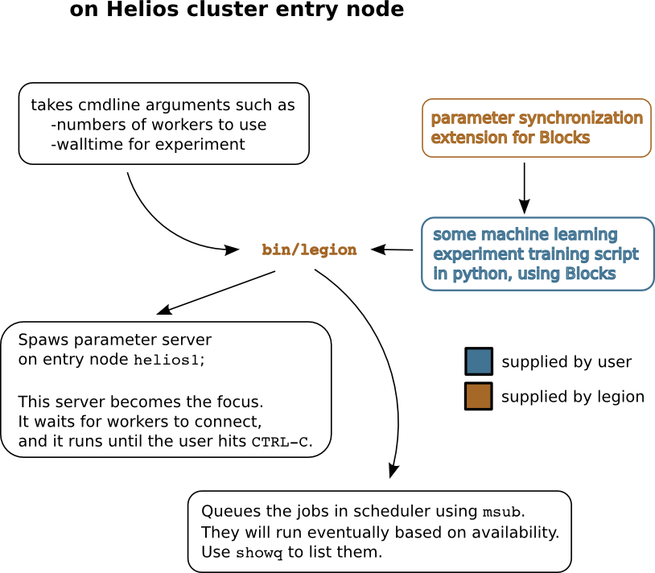

Welcome to Legion' documentation!
=================================
Legion is a machine learning and deep learning distributed training solution.

It is currently at a late prototype stage and it is intended for use
a the University of Montreal on clusters such as Helios (from Calcul Quebec).

It contains an implementation of Asynchronous Stochastic Gradient Descent (ASGD) with:

* parameter server in python (over TCP sockets)
* Blocks_ extensions to synchronize the parameters on individual workers with the parameter server
* script to launch everything on the Helios cluster
* examples of scripts adapted to be used with Legion

For more information about the Helios cluster, see:

* http://www.calculquebec.ca/en/resources/compute-servers/helios
* https://wiki.calculquebec.ca/w/Helios/en

.. warning::
   Legion is **not** a way to use multiple GPUs in **one Theano process**.

.. warning::
   Legion is **not** a good strategy to explore a large collection of hyper-parameters.
   It  goal is to speed up training in **one** experiment.

.. tip::
   Adaptating your Blocks (or Theano) programs to use Legion is relatively easy,
   but getting a performance gain with Legion is not trivial.
   One rule of thumb seems to be that, if you can run through your whole dataset
   relatively quickly (let's say less than 30 seconds), then you probably will
   not get anything out of using Legion. Stay with regular SGD.

Note that you should use the cluster as usual (with ``jobdispatch`` or ``msub``)
if you want to perform hyper-parameter optimization.
In almost all cases, given 128 available GPU slots, running 128 single-GPU jobs in parallel in faster
than running the same 128 jobs in a queue where each job tries to use multi-GPU.

.. _Blocks: https://github.com/mila-udem/blocks

Overview
--------

Quickstart
--------

Clone the library and install the python module.

.. code-block:: bash

   $ git clone git@github.com:JulesGM/legion.git legion
   $ cd legion
   $ python setup.py develop --user

Modify your Blocks experiment to add the special legion modules that feature automatic parameter synching.
See particular examples for how to build a dictionary of theano shared variables representing the model parameters.
This is facilitated by the fact that Blocks gives access to the computational graph.

>>> from legion.blocks_extensions import SharedParamsAutoSync, SharedParamsRateLimited
>>> from legion.blocks_extensions import Timestamp, StopAfterTimeElapsed
>>> # build the dictionary of parameters
>>> params_to_sync = ...
>>> # instantiate Blocks extension to be used in MainLoop
>>> special_extension = SharedParamsRateLimited(params=params_to_sync, every_n_batches=1, alpha=0.5, beta=0.5, maximum_rate=0.25)

Debug the thing locally and then move over to the Helios cluster, where everything has to be set up again in the usual way.

.. code-block:: bash

    $ ssh helios.calculquebec.ca
    $ screen -S my_experiment
    $ cd pathto/legion
    $ bin/legion pathto/run_blocks_experiment.py --allocation="jvb-000-ag" --instances=4 --walltime=3:00:00

The execution of ``bin/legion`` takes over this screen and will only end when you hit ``ctrl-c``.
This means that the parameter server is running on the entry node ``helios1`` of the Helios cluster.
It consumes reasonably little computation power and we have been given permission to run this
on the entry node by the administrators of the Helios cluster (because it's a derogation to the usual rules
that say that the entry node is not meant to run jobs).

Within another screen, you can check on the queued jobs by using ``showq``.

Usage
--------

Legion can be used with or without the provided Blocks extensions.
The communication with

For more information about the actual protocol used, check out this
:doc:`the lower-level description <lower_level_description>`.

For more information about the Blocks extensions, check out this
:doc:`description of the Blocks extensions <blocks_extensions>`.

